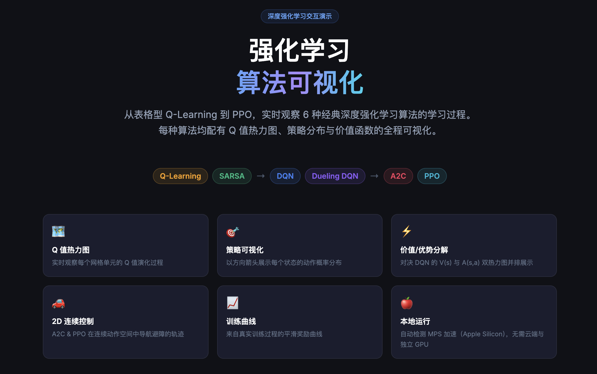
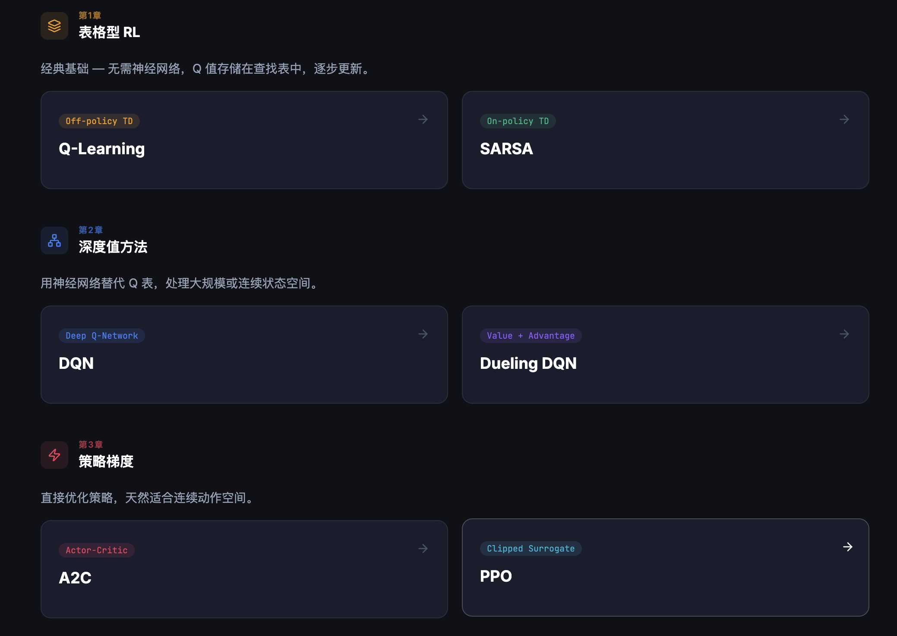
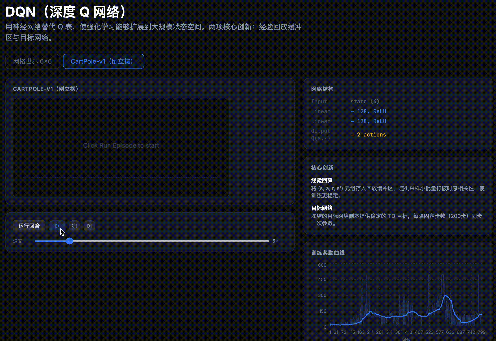
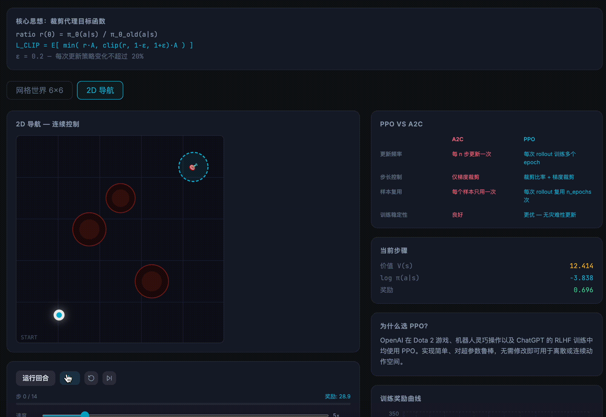

<div align="center">


<br/><br/>

# RL Visualizer · 强化学习算法可视化

**从表格型 Q-Learning 到 PPO，实时观察 6 种经典深度强化学习算法的学习全过程**

*Watch 6 classic deep RL algorithms learn in real time — interactive, bilingual, runs on your MacBook.*

<br/>

[**查看算法 →**](#-算法一览) · [**快速开始 →**](#-快速开始) · [**项目结构 →**](#-项目结构)

</div>

---

## ✨ 为什么要做这个项目

深度强化学习算法（DQN、PPO、A2C…）对很多人来说是一个黑盒。
论文里写满了公式，代码里充斥着矩阵运算，但**"训练时究竟发生了什么"**往往难以直观感知。

**RL Visualizer** 把每一步都摊开来给你看：

| 你想理解的问题 | 本项目的可视化 |
|---|---|
| Q 值是怎么慢慢变得有意义的？ | Q 值热力图随训练/回放实时更新 |
| 策略"学到了"什么？ | 每个状态上的策略箭头，方向即最优动作 |
| Dueling DQN 把网络拆成两部分有什么意义？ | V(s) 价值图与 A(s,a) 优势图并排对比 |
| PPO 的裁剪怎么防止策略崩坏？ | 算法原理面板 + log π(a\|s) 实时显示 |
| 连续动作空间里策略长什么样？ | 2D 导航轨迹动画，实时追踪智能体路径 |

---

## 🎬 Demo 预览

<div align="center">



<sub>主界面 · 六种算法 + Q 值热力图 / 策略可视化 / 价值优势分解 / 2D 连续控制 / 训练曲线 / 本地运行</sub>

<br/><br/>



<sub>分三章循序渐进 · 表格型 RL → 深度值方法 → 策略梯度</sub>

</div>

<br/>

### 🕹️ 网格游乐场 · 观看学习 <sub>(招牌功能)</sub>

<div align="center">


<sub>自己画迷宫、调 α/γ/ε，实时观看策略从随机逐渐收敛；动画长度随收敛快慢自适应，最后小人沿最优路径走到终点</sub>

</div>

<br/>

<table>
<tr>
<td width="50%" align="center">

<br/><b>🧠 CartPole · DQN / Dueling DQN</b>
<br/><sub>经验回放 + 目标网络；Dueling 把 Q 拆成 V(s) 与 A(s,a) 并排展示</sub>
</td>
<td width="50%" align="center">

<br/><b>🎯 2D Navigation · A2C / PPO</b>
<br/><sub>连续动作空间中绕过障碍到达目标，轨迹实时动画</sub>
</td>
</tr>
</table>

---

## 🧠 算法一览

### Chapter 1 · 表格型强化学习 (Tabular RL)

| 算法 | 类型 | 环境 | 核心特点 |
|------|------|------|----------|
| **Q-Learning** | Off-policy TD | GridWorld · Cliff Walking | 始终以最优下一动作更新，敢走险路 |
| **SARSA** | On-policy TD | GridWorld · Cliff Walking | 以实际行动更新，保守安全 |

> **对比亮点**：Cliff Walking 中两者走出截然不同的路径 — 一个贴着悬崖边，一个绕道而行。

### Chapter 2 · 深度值方法 (Deep Value-Based)

| 算法 | 环境 | 核心创新 |
|------|------|----------|
| **DQN** | GridWorld · CartPole | 经验回放缓冲区 + 目标网络 |
| **Dueling DQN** | GridWorld · CartPole | V(s) + A(s,a) 双流网络结构 |

> **可视化亮点**：Dueling DQN 页面并排显示 Q 值图、价值图与优势图，三者对比一目了然。

### Chapter 3 · 策略梯度 (Policy Gradient)

| 算法 | 环境 | 核心创新 |
|------|------|----------|
| **A2C** | GridWorld · 2D Navigation | 演员-评论家，优势函数估计 |
| **PPO** | GridWorld · 2D Navigation | 裁剪代理目标，防止策略崩坏 |

> **可视化亮点**：2D 连续导航环境中，智能体需绕过多个障碍物到达目标，轨迹实时动画。

---

## 🎨 可视化功能详解

```
每个算法页面的布局

┌─ 环境标签 ─────────────────────────────────────────────────────┐
│  [GridWorld]  [CartPole / CliffWalking / 2D Navigation]        │
├─────────────────────────────┬──────────────────────────────────┤
│                             │                                  │
│   游戏环境动画               │   可视化面板                     │
│   · 热力图背景（Q/V值）      │   · Q 值热力图图例               │
│   · 策略方向箭头             │   · 当前步骤信息                 │
│   · 智能体位置               │     (state / action / reward)   │
│                             │   · 训练奖励曲线                 │
│   播放控制                  │                                  │
│   [运行回合] [▶] [⏹] [⏭]  │                                  │
│   速度滑条  步骤进度条       │                                  │
│                             │                                  │
├─────────────────────────────┴──────────────────────────────────┤
│   算法原理面板（公式 · 直觉解释 · 与其他算法的对比）             │
└────────────────────────────────────────────────────────────────┘
```

---

## 🚀 快速开始

### 环境要求

- macOS 12+ (Apple Silicon or Intel)
- Python 3.10+
- Node.js 18+

### 1 · 克隆项目

```bash
git clone https://github.com/<your-username>/RL-visual.git
cd RL-visual
```

### 2 · 安装后端依赖

```bash
cd backend
python3 -m venv venv && source venv/bin/activate
pip install -r requirements.txt
```

### 3 · 训练模型（一次性，约 20–30 分钟）

```bash
python train.py
# Apple Silicon MPS 加速自动启用，CPU 约 30 min，MPS 约 10 min
```

只训练单个算法：

```bash
python train.py --algo q_learning   # < 1 min
python train.py --algo sarsa        # < 1 min
python train.py --algo dqn          # ~5 min
python train.py --algo dueling_dqn  # ~5 min
python train.py --algo a2c          # ~8 min
python train.py --algo ppo          # ~10 min
```

### 4 · 启动后端

```bash
uvicorn main:app --reload --port 8000
```

### 5 · 启动前端（新终端）

```bash
cd frontend
npm install && npm run dev
```

打开 [http://localhost:5173](http://localhost:5173) 🎉

---

## 🏗️ 项目结构

```
RL-visual/
├── backend/
│   ├── envs/
│   │   ├── gridworld.py       # GridWorld 6×6 & Cliff Walking 4×12
│   │   ├── cartpole_env.py    # gymnasium CartPole-v1 包装器
│   │   └── nav2d.py           # 自定义 2D 连续导航环境
│   ├── agents/
│   │   ├── q_learning.py      # 表格型 Q-Learning + Q 表快照
│   │   ├── sarsa.py           # 表格型 SARSA
│   │   ├── dqn.py             # DQN + 经验回放 + 目标网络
│   │   ├── dueling_dqn.py     # Dueling DQN (V+A 双流)
│   │   ├── a2c.py             # A2C (离散 & 连续动作)
│   │   └── ppo.py             # PPO + GAE + 多轮更新
│   ├── weights/               # 预训练权重（训练后生成）
│   ├── training_data/         # 训练曲线 JSON（训练后生成）
│   ├── train.py               # 训练脚本
│   └── main.py                # FastAPI 服务
│
└── frontend/
    └── src/
        ├── i18n/              # 中英双语翻译系统
        ├── pages/             # 7 个页面（首页 + 6 个算法页）
        └── components/        # GridWorld SVG · CartPole Canvas · Nav2D SVG
                               # Q热力图 · 策略箭头 · 训练曲线 · 播放控件
```

---

## 🛠️ 技术栈

| 层 | 技术 |
|---|---|
| **后端** | Python · FastAPI · PyTorch · gymnasium |
| **前端** | React 18 · TypeScript · Vite · Tailwind CSS · Recharts |
| **可视化** | 自定义 SVG（GridWorld / Nav2D）· Canvas（CartPole） |
| **计算** | MPS (Apple Silicon) → CUDA → CPU 自动检测 |
| **语言** | 中文 / English 一键切换 |

---

## 🔮 Roadmap

- [ ] Rainbow DQN（PER + n-step + Noisy Net）
- [ ] SAC 软演员-评论家（连续动作）
- [ ] 在线训练模式（WebSocket 实时推流）
- [ ] 模型权重 GitHub Release 自动分发

---

## 📄 License

MIT © 2025

---

<div align="center">
如果这个项目对你有帮助，欢迎给个 ⭐ Star！<br/>
<sub>Built with PyTorch · FastAPI · React</sub>
</div>
